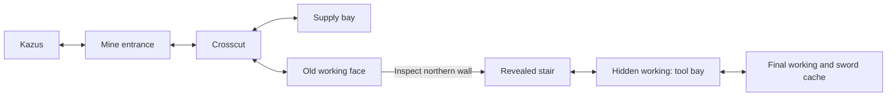

# Mithril Mines — first refactor milestone

Implemented locally on 2026-09-13. This is the Mines prototype from
[DUNGEON-REFACTOR.md](DUNGEON-REFACTOR.md), not completion of the continent-wide refactor.

## The playable route

Two compact excavations replace the three generic generated maps. The first
has a crosscut and supply bay; the far northern working face conceals a stair.
A Kazus resident supplies the clue. Inspecting the wall reveals the native
stair artwork and activates the transition. The second section leads through a
tool bay to the final working. Entering that working completes `mines_explored`
without a boss, a fake boss platform or a mandatory warp.

The tool cache guarantees a Mithril helmet and the destination cache guarantees
a Mithril sword. These are existing items from the mine's existing permitted
loot pool. A full inventory leaves the chest closed and its reward unclaimed;
exploration completion does not depend on accepting an item. Return follows
the stairs back to the actual Kazus doorway.

The source mine's concealed passage and equipment cache informed the design.
Its original two-sword reward has been adapted to a sword and helmet for this
prototype. [NES mine maps](https://shrines.rpgclassics.com/nes/ff3/maps/kazus.shtml).

There are three deliberately limited branch variants in each section. The
landmarks and route remain identifiable. Both sections use the native mine
encounters and rate; the second is an exploration map rather than a boss room.

## New architecture used by the prototype

- `src/dungeons/definitions/mines.js`: complete room/link plan, named features,
  authored discovery, rewards, endpoint and safe entrance metadata.
- `src/dungeons/materials/mine.js`: native mine walls painted around finished
  walkable ground. Painting does not carve away the intended route.
- `src/dungeons/compile.js`: planner/material dispatch and adapter to existing
  map data; resolves explicit ports and replays feature changes.
- `src/dungeons/run-state.js`: bounded shared save codec for versioned personal
  progress, used by client parsing, serialization, title restore and server
  validation. Features are named rather than inferred from old coordinates.

The legacy generator still serves the other ten registered dungeons. Their
structural snapshots remain unchanged. The Mines snapshots now also include
route and feature metadata, so changes to a hidden transition cannot pass a
tile-only comparison. Debug labels, feature markers and plan descriptions
understand the authored sections.

## Persistence and replay

An unfinished personal run keeps its seed, discovered stair and opened caches.
Re-entering the mine uses its entrance as the safe starting point. A completed
run starts anew on a later entrance only after the two guaranteed equipment
caches have been claimed. Optional supplies do not block completion/replay.
An older or incompatible run record is discarded; permanent character flags
and inventory are retained. Saved indoor positions in redesigned or retired
mine maps resolve to a safe position outside the mine in Kazus. Ordinary saves
continue using the game's existing world-position checkpoint.

Ordinary chest saves now happen after the reward and opened-chest state are
both applied. The former ordering could persist consumption before its item.
Mimic chests still save consumption before entering the encounter flow.

This prototype implements personal run persistence. It does not implement the
planned server-issued shared run IDs, synchronized switches or synchronous
co-op combat. Those remain explicit follow-up work before claiming shared
exploration support.

## Review and checks

`tools/render-mithril-mines.mjs` reproduces three inspected game-camera views:
`/tmp/ff3mmo-evaluation/mines-face-game.png`, `mines-stair-game.png` and
`mines-cache-game.png`. It uses the actual renderer, sprite and message box,
with the game's font patch. These are staged review images, not browser captures.

`tools/check-mithril-mines.mjs` checks 400 seeds per section using the actual
movement predicate, then walks the route through the real input/transition
handlers. It exercises discovery, the endpoint, full inventory, guaranteed
loot, save parsing, re-entry, return to Kazus and run-reset conditions. Random
encounters are suppressed for that walking check; encounter and combat tests
cover those separately.

`tools/check-dungeon-run-save.mjs` imports the actual API in a disposable
directory and checks server/client round trips and incompatible records.
It never opens the working or production database.

Wider regression coverage includes the existing dungeon, NPC, dialogue, save,
encounter and multiplayer protocol checks. The old cave-variety tests now
recognize this authored design's intended variants; they retain their prior
requirements for the legacy layouts.

Validation completed locally: the existing release gates passed after fixing
the authored-layout assumptions and updating the Mines snapshots. All 15
focused follow-up checks passed, including lint, save round trips, dialogue
fit and dungeon routes. An isolated Chromium boot smoke test and server health
check passed. The boot check verifies module evaluation, not a manual gameplay
session. Other dungeons' structural snapshots are unchanged. No deployment
was performed for this milestone.

Next design proof: Tower of Owen, with a dedicated mechanical material/layout
and its own vertical journey. The mine painter is not a tower template.
